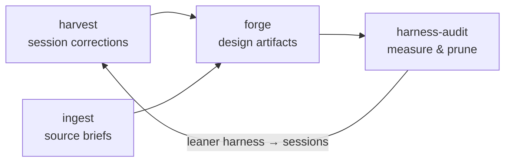

`AGENT-KITCHEN`

agent-kitchen is a second-order harness: a kitchen for the things that configure coding agents (skills, hooks, rules, CLAUDE.md, workflows). It runs as dotfiles for the agent.

The kitchen is built on the idea that:

- A frontier model in 2026 is very competent at most things, but its default in any domain is the competent average version of the thing. The artifacts here are
  commitments that drag the model off that median in a chosen direction.
- Every artifact competes with two forces: the unaided frontier model, which absorbs
  generic craft with each release, and the owner's time, which every artifact charges rent on.
- So durable value comes from what the model cannot have: the owner's taste and intent
  made operational, local truths of a repo or team, verified facts from after the training cutoff, and failures actually observed in sessions.
- Everything else gets absorbed, so deletion is the expected end of every artifact here, not a failure of one.

─────────────────────

`THE SKILLS`

The kitchen can operate as a set of skills used as needed, or as a loop:
`harvest` and `ingest` feed `forge`; probes and live use check the artifacts;
`harness-audit` removes what doesn't earn its place; sessions feed the next harvest.



| Surface                 | Role                                                                                                                                                                                                                                                                            |
| ----------------------- | ------------------------------------------------------------------------------------------------------------------------------------------------------------------------------------------------------------------------------------------------------------------------------- |
| `forge`                 | One triage ladder routes a behavior to the right surface (skill, hook, path-scoped rule, CLAUDE.md, workflow, subagent, MCP), with a stance that sets the bar each artifact has to clear and judges it by the work it makes the agent produce, not by the artifact's own shape. |
| `harness-audit`         | Inventories everything loaded at session start, counts the per-session token cost, and runs four checks: self-consistency, duplication across scopes, enforcement parity, scope discipline. Built to remove things rather than add.                                             |
| `harvest`               | Mines session transcripts for the corrections the user had to make twice, dedups them against the standing harness, and hands survivors to the forge as earned-intent evidence. The without-the-skill baseline already ran, in production, in those sessions.                   |
| `ingest`                | Turns resources provided by the user into an artifact by fanning out one reader subagent per source, grounded in verbatim quotes.                                                                                                                                               |
| `state.md` + `hacks.md` | Verified snapshot of Claude Code's surfaces and lesser-known features, re-checked against the live changelog on each release.                                                                                                                                                   |
| `changelog.md`          | Provenance ledger: why each artifact exists, what it was re-tested against, and the keep/revise/delete verdicts. The artifacts themselves carry only a one-line model pin.                                                                                                      |

─────────────────────

`INSTALL`

Both plugins are served through the `claudia` marketplace, whose catalog is hosted in
this repo:

```bash
/plugin marketplace add claudialnathan/agent-kitchen
/plugin install agent-kitchen@claudia   # the kitchen: forge, harness-audit, harvest, ingest
/plugin install skills@claudia          # the applied skills (from the skills repo)
```

Commit-SHA versioning (no version field), so a pushed commit reaches other repos on the
next `/plugin marketplace update claudia` → `/plugin update`.
